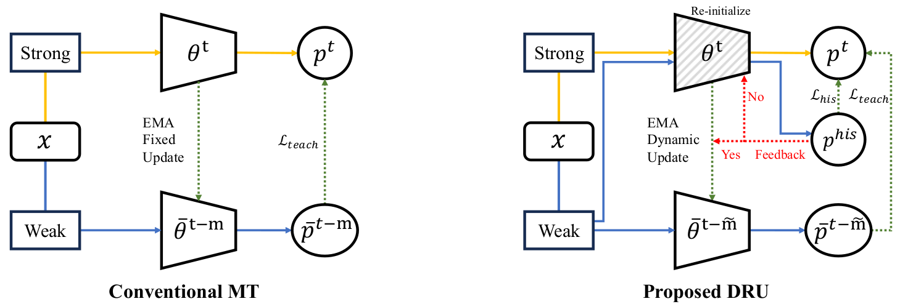
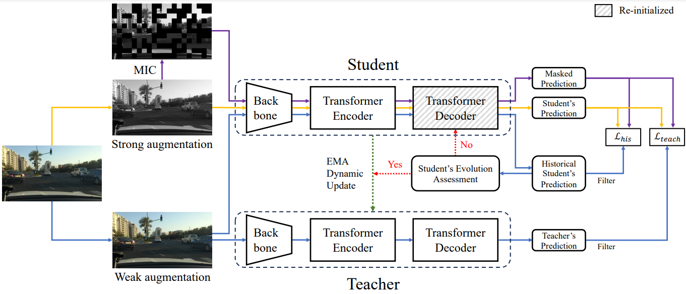

# Dynamic Retraining-Updating Mean Teacher for Source-Free Object Detection (ECCV 2024)
*Trinh Le Ba Khanh, Huy-Hung Nguyen, Long Hoang Pham, Duong Nguyen-Ngoc Tran and Jae Wook Jeon*

Official Pytorch implementation of `Dynamic Retraining-Updating Mean Teacher for Source-Free Object Detection, ECCV 2024` [paper](https://arxiv.org/pdf/2407.16497).

<p align="center">
  
</p> 

The overview of our DRU method is presented in the following figure. For more details, please refer to the [paper](https://arxiv.org/pdf/2407.16497).
<p align="center">
  
</p> 

## 1. Installation

### 1.1 Requirements

- Linux, CUDA >= 11.1, GCC >= 8.4

- Python >= 3.8

- torch >= 1.10.1, torchvision >= 0.11.2

- Other requirements

  ```bash
  pip install -r requirements.txt
  ```

### 1.2 Compiling Deformable DETR CUDA operators

```bash
cd ./models/ops
sh ./make.sh
# unit test (should see all checking is True)
python test.py
```

## 2. Dataset Preparation

Our method used 3 popular SFOD benchmarks:

- city2foggy: Cityscapes (source domain) → FoggyCityscapes with foggy level 0.02 (target domain).
- sim2city: Sim10k (source domain) → Cityscapes with `car` class (target domain).
- city2bdd: Cityscapes (source domain) → Bdd100k-daytime (target domain).

You can download the raw data from the official websites: [Cityscapes](https://www.cityscapes-dataset.com/downloads/),  [FoggyCityscapes](https://www.cityscapes-dataset.com/downloads/),  [Sim10k](https://fcav.engin.umich.edu/projects/driving-in-the-matrix), [Bdd100k](https://bdd-data.berkeley.edu/). The annotations are converted into COCO style, can download from [here](https://drive.google.com/file/d/1LB0wK9kO3eW8jpR2ZtponmYWe9x2KSiU/view?usp=sharing) (provided by [MRT-release](https://github.com/JeremyZhao1998/MRT-release)). The datasets and annotations are organized as:

```bash
[data_root]
└─ cityscapes
	└─ annotations
		└─ cityscapes_train_cocostyle.json
		└─ cityscapes_train_caronly_cocostyle.json
		└─ cityscapes_val_cocostyle.json
		└─ cityscapes_val_caronly_cocostyle.json
	└─ leftImg8bit
		└─ train
		└─ val
└─ foggy_cityscapes
	└─ annotations
		└─ foggy_cityscapes_train_cocostyle.json
		└─ foggy_cityscapes_val_cocostyle.json
	└─ leftImg8bit_foggy
		└─ train
		└─ val
└─ sim10k
	└─ annotations
		└─ sim10k_train_cocostyle.json
	└─ JPEGImages
└─ bdd10k
	└─ annotations
		└─ bdd100k_daytime_train_cocostyle.json
		└─ bdd100k_daytime_val_cocostyle.json
	└─ images
```

## 3. Training and Evaluation

### 3.1 Training

First, run `source_only` to pretrain the Source-only model. Then, run `teaching_standard` to train the conventional Mean-Teacher framework OR `teaching_mask` to train the proposed DRU.

For example in `city2foggy` benchmark, first edit the files in `configs/def-detr-base/city2foggy/` to specify your own `DATA_ROOT` and `OUTPUT_DIR`, then run:

```bash
sh configs/def-detr-base/city2foggy/source_only.sh
sh configs/def-detr-base/city2foggy/teaching_standard.sh
sh configs/def-detr-base/city2foggy/teaching_mask.sh
```

### 3.2 Evaluation

To evaluate the trained model and get the predicted results, run:

```bash
sh configs/def-detr-base/city2foggy/evaluation_source_only.sh
sh configs/def-detr-base/city2foggy/evaluation_teaching_standard.sh
sh configs/def-detr-base/city2foggy/evaluation_teaching_mask.sh
```

## 4. Experiments 

All experiments are conducted with batch size 8 (for `source_only`: 8 labeled samples; for `teaching_standard` or `teaching_mask`: 8 unlabeled samples), on an NVIDIA Quadro RTX 8000 GPU (48GB).

**city2foggy**: Cityscapes → FoggyCityscapes(level 0.02)

Training stage   | AP@50 | logs & weights                                               |
| ---------------- | ----- | ------------------------------------------------------------ |
| `source_only`      | 29.5  | [Source-only](https://drive.google.com/drive/folders/1v_ixx3iPlI9MpSBoxorohLDcGW1_Kk7R?usp=sharing)|
| `teaching_standard` | 37.4  | [MT](https://drive.google.com/drive/folders/191EkAXNAvoZFjk9FdItF7oHzGL_yMQ_m?usp=sharing)|
| `teaching_mask`    | 43.6  | [DRU](https://drive.google.com/drive/folders/1BCndrRs6WyBsWwYI8n68KWYLzLl18yUG?usp=sharing)|

**city2bdd**: Cityscapes → Bdd100k(daytime)

Training stage   | AP@50 | logs & weights                                               |
| ---------------- | ----- | ------------------------------------------------------------ |
| `source_only`      | 29.1  | [Source-only](https://drive.google.com/drive/folders/1PUYNsw_dTGh-laoAAOg202E6bgJA84VE?usp=sharing)|
| `teaching_standard` | 32.6  | [MT](https://drive.google.com/drive/folders/16IlimDDUWymv5uZCvl6bARKi6YlDF84t?usp=sharing)|
| `teaching_mask`    | 36.6  | [DRU](https://drive.google.com/drive/folders/1uoMv1iD2-67Ohim22U88P3M1RE4MIN9K?usp=sharing)|

**sim2city**: Sim10k → Cityscapes(car only)

Training stage   | AP@50 | logs & weights                                               |
| ---------------- | ----- | ------------------------------------------------------------ |
| `source_only`      | 48.9  | [Source-only](https://drive.google.com/drive/folders/1ZMM56op0HinkT102xL7uZFH3MINnoIBl?usp=sharing)|
| `teaching_standard` | 56.2  | [MT](https://drive.google.com/drive/folders/1FmiUAAnq6ScJ_UUqg0boWg3FxRhqRwWH?usp=sharing)|
| `teaching_mask`    | 58.7  | [DRU](https://drive.google.com/drive/folders/11g-_M3uTltme2JXAMlhZS2vcy7TENOtl?usp=sharing)|

## 5. Citation

If you find our paper or code useful, please cite our work:

```
@inproceedings{trinh2024dru,
  title={Dynamic Retraining-Updating Mean Teacher for Source-Free Object Detection},
  author={Trinh Le Ba Khanh, Huy-Hung Nguyen, Long Hoang Pham, Duong Nguyen-Ngoc Tran and Jae Wook Jeon},
  booktitle={ECCV},
  pages={https://arxiv.org/pdf/2407.16497},
  year={2024}
}
```

## 6. Acknowledgement

This project is built upon [MRT-release](https://github.com/JeremyZhao1998/MRT-release), [Deformable DETR](https://github.com/fundamentalvision/Deformable-DETR), [DT-ST](https://github.com/DZhaoXd/DT-ST) and [MIC](https://github.com/lhoyer/MIC), and we'd like to appreciate for their excellent works.

## 7. Contact

If you have any issue with code or paper, feel free to contact [```trinhlbk@skku.edu```](mailto:trinhlbk@skku.edu).
